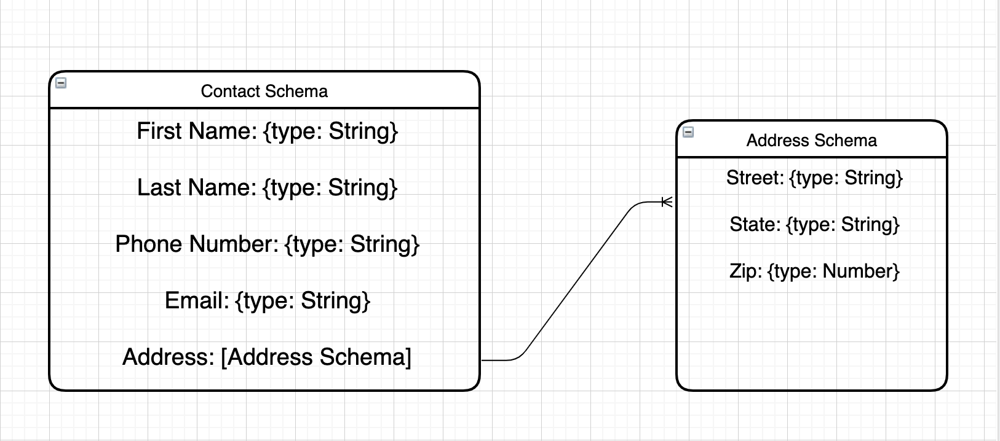

# Back-end and Implementation

Before proceeding with the back-end development, make sure you have completed all the necessary installations. You can check the [installations](./installations.md) file in the GitHub repository to ensure you have all the required software installed.

## Useful links

- [Express](https://expressjs.com/)
- [MongoDB](https://www.mongodb.com/)
- [Mongoose](https://mongoosejs.com/)
- [Axios](https://axios-http.com/docs/intro)

## Step 0 - What's a MongoDB model ?

A model is a class with which we construct documents. In this workshop, we will use the Mongoose library to define our models. Mongoose provides a straight-forward, schema-based solution to model your application data. It includes built-in type casting, validation, query building, business logic hooks and more, out of the box.
The schema below explains how a model works with schemas.



## Step 01 - Call sign up endpoint

To communicate with the back-end, you need to understand how to make a request from the front-end. The back-end already has an endpoint to sign up a user. In this step, you will learn how to use the [Axios](https://www.digitalocean.com/community/tutorials/react-axios-react) module to make a request.

Navigate to the `front/src/components/Register.js` file and implement the `signup` method by following these steps:
  - Use axios module with a **post** method (**post** is used to send datas to back whereas **get** is used to only get datas)
  - The URL you must call is `http://localhost:8080/auth/signup`
  - Send all the inputs in the body of the request
  - Use F12 in the web app to debug if necessary.
 
## Step 02 - Login endpoint

In this step, you will learn how to create a server with APIs and databases. We will use Mongoose to communicate with the database and Express to build the server's APIs. You can refer to this [course](https://openclassrooms.com/fr/courses/6390246-passez-au-full-stack-avec-node-js-express-et-mongodb) to understand how it works.

Navigate to the `back/routes/auth.js` file and create a new **post** by following these steps::
  - it should match `/login`
  - it receives two parameters: `username` and `password`
  - it check if the `password` matchs with the user's one
  - it send back the `user` if the password is good else it send a error message

Use the **User** model which is already created (it is defined in `back/models/User.js`).
You can refer to [this](https://openclassrooms.com/fr/courses/6390246-passez-au-full-stack-avec-node-js-express-et-mongodb/6466533-verifiez-les-informations-didentification-dun-utilisateur#/id/r-6466510) part of the course to understand how the **findOne** method is used.

## Step 03 - Create post endpoint

In this step you will learn how to user the **Post** model.

This model contains the following elements:
  - `title`: the title of the post
  - `description`: the content of the post

Now that you understand this model you can create a new file in `back/routes` called `post.js` and create a new **post** by following these steps:
  - Create a new **post** endpoint that matches `/add`
  - The endpoint should receive three parameters: `username`, `title` and `content`
  - Add a new post in the database with the parameters.

Don't forget to require the post file in `back/routes/index.js` and add the following line in `back/app.js`:

```js
app.use('/post', post);
```

Look at the [save](https://openclassrooms.com/fr/courses/6390246-passez-au-full-stack-avec-node-js-express-et-mongodb/6466398-enregistrez-et-recuperez-des-donnees#/id/r-6466369) method.


## Step 04 - Get posts endpoint

Now you start to understand how to build your server. For this last step use all what you've learned in this workshop.

You will need to create a **get** endpoint which must match `/post/`.

It just return all the posts of the current user.

Don't be affraid to search on internet.
