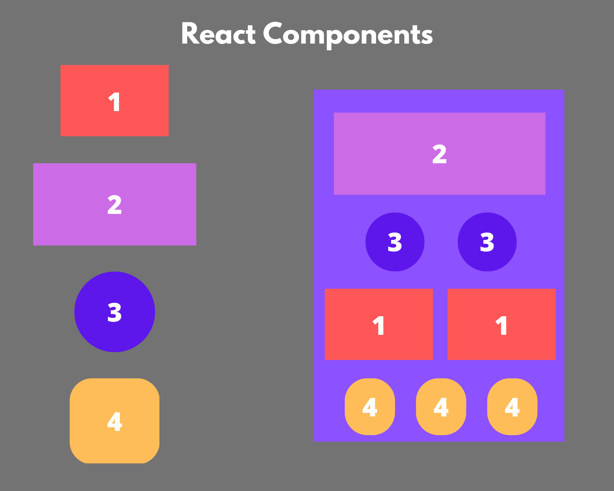
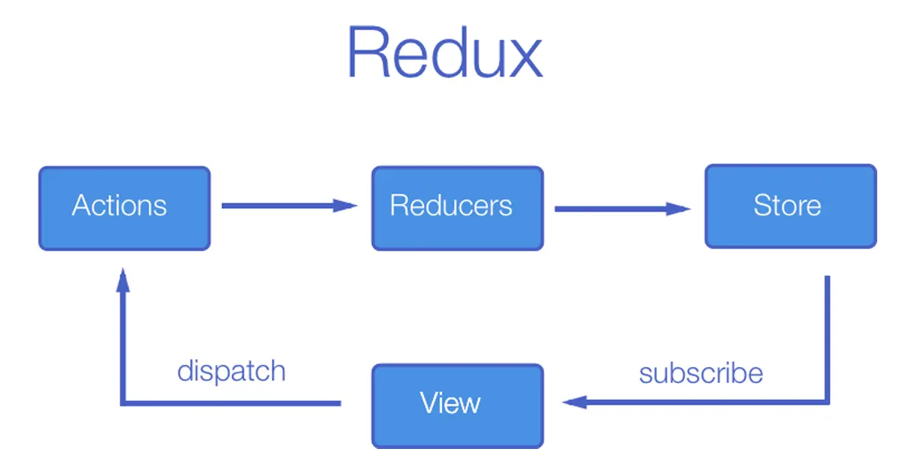

# Front-End

Before continuing, make sure you've done all the steps in the [installation](./installations.md) section.

## Useful links

- [React](https://reactjs.org/)
- [React Router](https://reactrouter.com/)
- [Axios](https://axios-http.com/docs/intro)
- [Redux](https://redux.js.org/)

## Step 0 - What's a component ?

A component is a piece of code that can be reused in your application. It is a function that returns a piece of HTML. It is a good practice to separate your code into components to make it more readable and maintainable. The following image shows multiple components that makes up a React application, represented by multiple colored boxes.



If you want to know more about components, you can read the [React documentation](https://reactjs.org/docs/components-and-props.html).

## Step 1 - Register Page

First, we'll create the register page. This page will allow users to create an account on the application. We'll start by modifying a file in the `src` folder called `Register.js`. This file will contain the code for the register page.


Now you can modify this file in order to have a simple form with a username, email, and password field.

## Step 2 - Login Page

Now we'll create the login page. This page will allow users to login to the application. We'll start by modifying a file in the `src` folder called `Login.js`. This file will contain the code for the login page.


Now you can modify this file in order to have a simple form with an email and password field.

## Step 3 - Home Page

When both of this pages are done, we'll create the home page. This page will allow users to see all the posts on the application. We'll start by modifying a file in the `src` folder called `Home.js`.


Now you can modify this file in order to have a simple page with a list of posts.

## Step 4 - States and Redux

As you can see in your `src` directory there is a folder called `redux`. This folder contains an exemple of a code related to the Redux library. Redux is a library that allows us to manage the state of our application. We'll use it to manage the state of the user and the posts. [Redux documentation](https://redux.js.org/) is a good place to start if you want to learn more about it.

Here is an explicative schema of how Redux works:



In your `action.js` file, you can see that we have two actions, `INCREMENT` and `DECREMENT`. These actions are just here to show you how to use Redux. You have to delete them and create your own `Login` actions. Here are an the beginning of what you have to do:

```js
export const LOGIN = "LOGIN";
export const LOGOUT = "LOGOUT";

export const login = (user) => {
  return {
    type: LOGIN,
    payload: user,
  };
};

export const logout = () => {
  return {
    type: LOGOUT,
  };
};
```

Now you hate to modify your `reducer.js` file in order to manage the state of the user.

When you're done, you can modify your `Login.js` file in order to dispatch the `login` action when the user is logged in and then save the user in the state.
Now that you have the user in the state, you will be able to use it in your `Home.js` file in order to display the username of the user in the header thanks to the `useSelector` hook obtained from the `react-redux` library af the following way:

```js
import { useSelector } from "react-redux";

const user = useSelector((state) => state);
```

## Step 5 - Home

Now that you are able to get all informations of the user from the database, you have now to modify your `Home.js` file in order to display all the posts of the user.

### Step 5.1 - Display one post

First, you have to create a component called `Post.js` in the `src` folder. This component will be used to display a post.

### Step 5.2 - Display all posts

In your user state, you have a `post` field that contains a list of posts, then, thanks to the last step and the `map` function, you can display all the posts of the user.

## Step 6 - Create a post

Now that you are able to display all the posts of the user, you have to create a page that will allow the user to create a post. You have to create a component called `CreatePost.js` in the `src` folder. This component will be used to create a post.