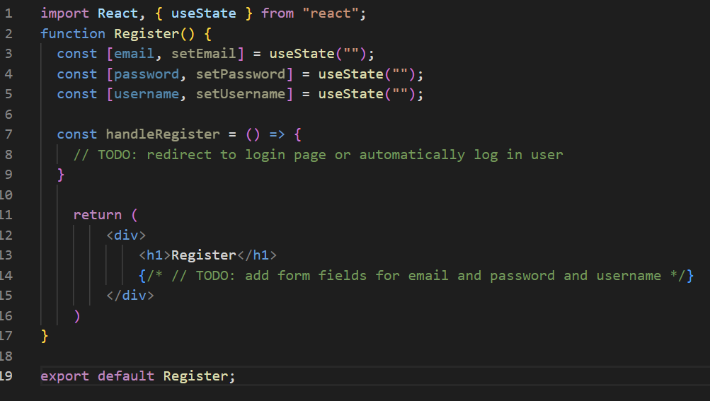
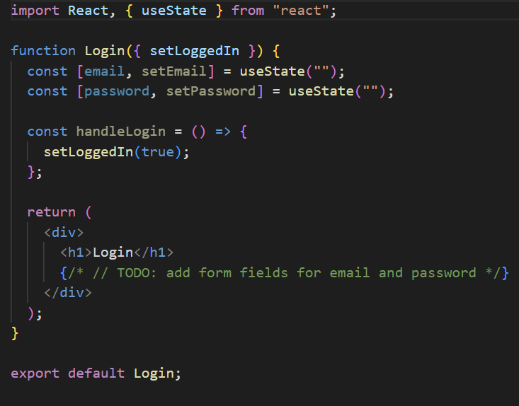
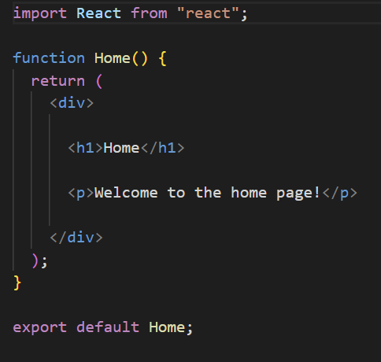

# Front-End

Before continuing, make sure you've done all the steps in the [installation](./installations.md) section.

## Step 1 - Register Page

First, we'll create the register page. This page will allow users to create an account on the application. We'll start by modifying a file in the `src` folder called `Register.js`. This file will contain the code for the register page.

Now you can modify this file in order to have a simple form with a username, email, and password field, as you can see below

## Step 2 - Login Page

Now we'll create the login page. This page will allow users to login to the application. We'll start by modifying a file in the `src` folder called `Login.js`. This file will contain the code for the login page.

Now you can modify this file in order to have a simple form with an email and password field, as you can see below

## Step 3 - Home Page

When both of this pages are done, we'll create the home page. This page will allow users to see all the posts on the application. We'll start by modifying a file in the `src` folder called `Home.js`.

Now you can modify this file in order to have a simple page with a list of posts, as you can see below